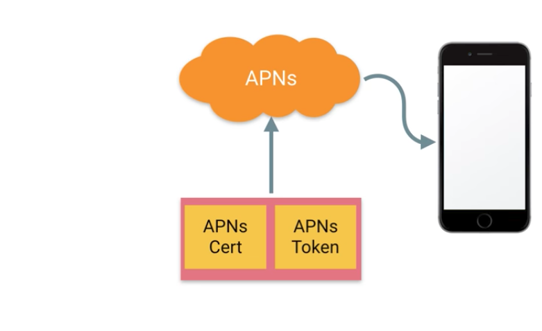
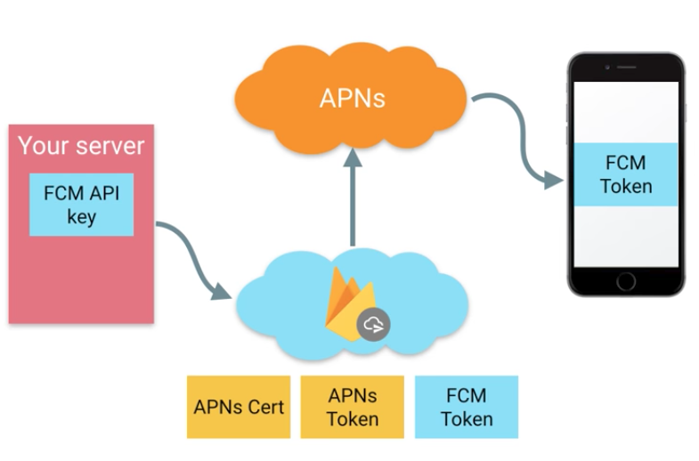
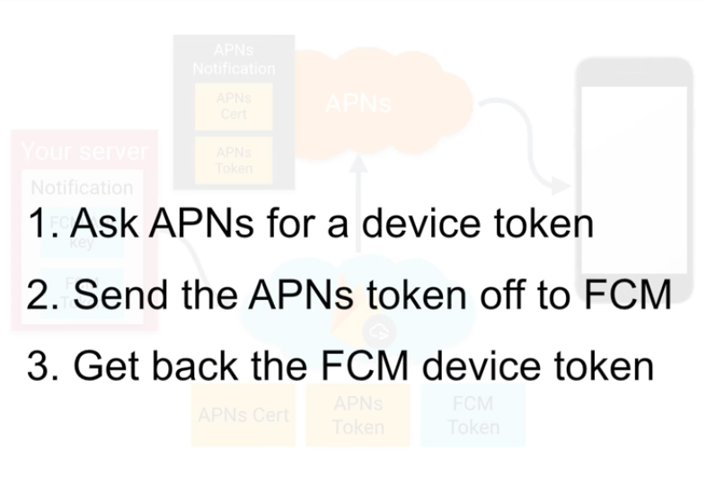
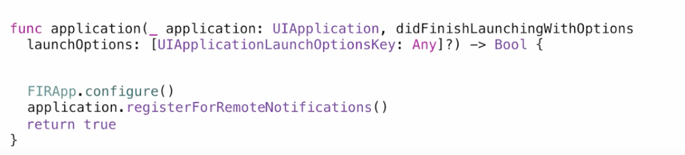
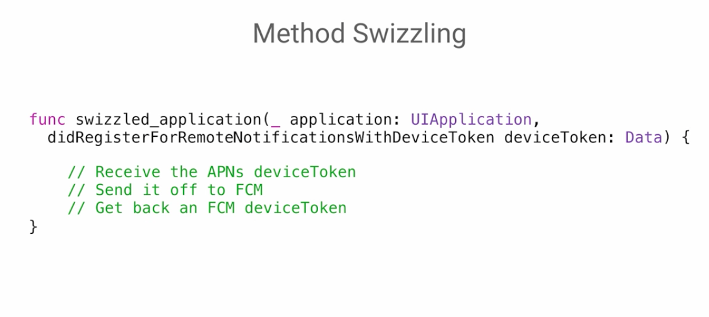
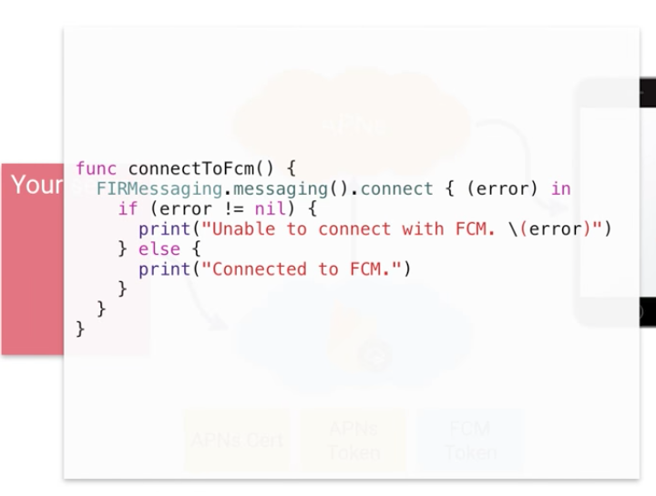
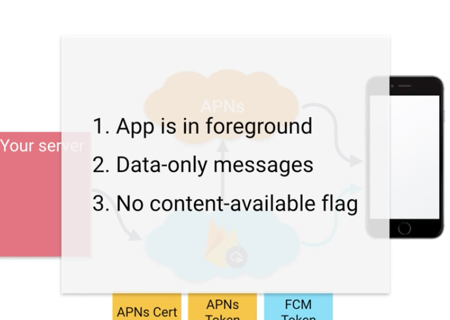

# Firebase Cloud Messaging on iOS

Deliver and receive messages and notifications on iOS.

<!-- TOC -->

- [Firebase Cloud Messaging on iOS](#firebase-cloud-messaging-on-ios)
    - [Introduction](#introduction)
    - [About FCM Messages](#about-fcm-messages)
        - [Key capabilities](#key-capabilities)
        - [Message types](#message-types)
    - [How it works?](#how-it-works)
    - [Understanding Firebase Cloud Messaging on iOS](#understanding-firebase-cloud-messaging-on-ios)
        - [APNs](#apns)
        - [FCM](#fcm)
        - [How?](#how)
        - [Under the hood](#under-the-hood)
        - [Connect to FCM](#connect-to-fcm)
        - [Restrictions](#restrictions)
    - [FCM Server](#fcm-server)
        - [FCM Server Protocols](#fcm-server-protocols)
        - [Build App Server Send Requests](#build-app-server-send-requests)
        - [Open sources implement FCM Server Protocols](#open-sources-implement-fcm-server-protocols)
            - [C# / .NET](#c--net)
            - [Python](#python)
            - [GO](#go)
            - [Ruby](#ruby)
            - [Rust](#rust)
            - [Node.js](#nodejs)
            - [PHP](#php)
            - [Java](#java)

<!-- /TOC -->

## Introduction

Using FCM, you can notify an iOS client app that new email or other data is available to sync. You can send notification messages to drive user re-engagement and retention.


## About FCM Messages

Firebase Cloud Messaging (FCM) offers a broad range of messaging options and capabilities

### Key capabilities

| Capability    |     Explains  |
| ------------- |---------------|
| Send notification messages or data messages    | Send notification messages that are displayed to your user. Or send data messages and determine completely what happens in your application code. See Message types. |
| Versatile message targeting    | Distribute messages to your client app in any of 3 ways—to single devices, to groups of devices, or to devices subscribed to topics.      |
| Send messages from client apps | Send acknowledgments, chats, and other messages from devices back to your server over FCM’s reliable and battery-efficient connection channel. |

### Message types

- Notification messages, sometimes thought of as "display messages." These are handled by the FCM SDK automatically.

```json
{
"message":{
    "token":"bk3RNwTe3H0:CI2k_HHwgIpoDKCIZvvDMExUdFQ3P1...",
    "notification":{
    "title":"Portugal vs. Denmark",
    "body":"great match!"
    }
}
}
```

> Notification messages have a predefined set of user-visible keys and an optional data payload of custom key-value pairs.

- Data messages, which are handled by the client app.

```json
{
  "message":{
    "token":"bk3RNwTe3H0:CI2k_HHwgIpoDKCIZvvDMExUdFQ3P1...",
    "data":{
      "Nick" : "Mario",
      "body" : "great match!",
      "Room" : "PortugalVSDenmark"
    }
  }
}
```

> Data messages have only custom key-value pairs. A message can transfer a payload of up to 4KB to a client app.

## How it works?

An FCM implementation includes two main components for sending and receiving:

- A trusted environment such as Cloud Functions for Firebase or an app server on which to build, target, and send messages and an iOS client app that receives messages.

- You can send messages via the [HTTP and XMPP APIs](#fcm-server). For testing or for sending marketing or engagement messages with powerful built-in targeting and analytics, you can also use the Notifications composer.


## Understanding Firebase Cloud Messaging on iOS

### APNs



### FCM



### How?



Everything we need



### Under the hood



> [Method swizzling](http://nshipster.com/method-swizzling/) is the process of changing the implementation of an existing selector

### Connect to FCM



### Restrictions



## FCM Server

### FCM Server Protocols

Currently FCM provides these raw server protocols:

- FCM HTTP v1 API
- Legacy HTTP protocol
- Legacy XMPP Protocol

### Build App Server Send Requests

Using the FCM app server protocols, you can build message requests and send them to these types of targets:

- Topic name
- Condition
- Device registration token
- Device group name (legacy protocols only)

### Open sources implement FCM Server Protocols

#### C# / .NET

- [firebaseNet](https://github.com/tiagomtotti/firebaseNet)

#### Python

- [PyFCM](https://github.com/olucurious/PyFCM)
- [fcm-django](https://github.com/xtrinch/fcm-django)
- [python-gcm](https://github.com/geeknam/python-gcm)

#### GO 

- [fcm](https://github.com/edganiukov/fcm)

#### Ruby

- [Andpush](https://github.com/yuki24/andpush)
- [fcm](https://github.com/spacialdb/fcm)

#### Rust

- [fcm-rust](https://github.com/panicbit/fcm-rust)

#### Node.js

- [fcm-push](https://github.com/nandarustam/fcm-push)

#### PHP

- [php-fcm](https://github.com/Paragraph1/php-fcm)
- [firebase-cloud-messaging-api-php-client](https://github.com/fre5h/firebase-cloud-messaging-api-php-client)

#### Java 

- [FcmJava](https://github.com/bytefish/FcmJava)
- [fcmxmppserver - XMPP Connection Server for FCM](https://github.com/carlosCharz/fcmxmppserver) 